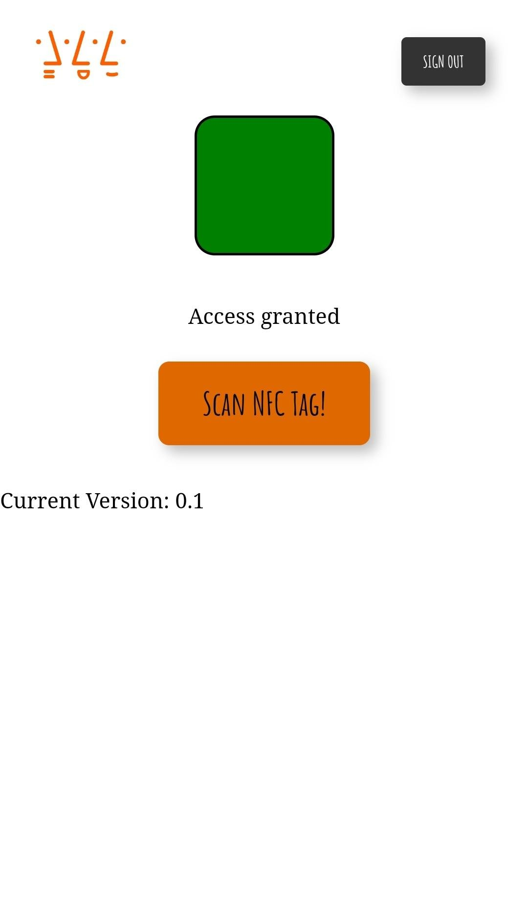

# Campus Card NFC Tag Reader

<!--  -->

This project is able to read and write nfc tags from campus cards using a android device and a chrome browser. It is initially developed to learn about fireBase database and including this with JavaScript. 

The outcome shows a system which is able to assign data to the campus card of a user to a database. 